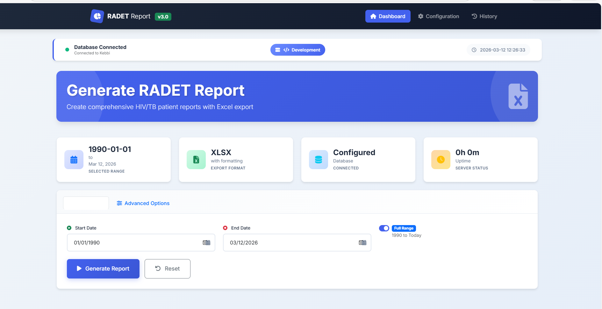
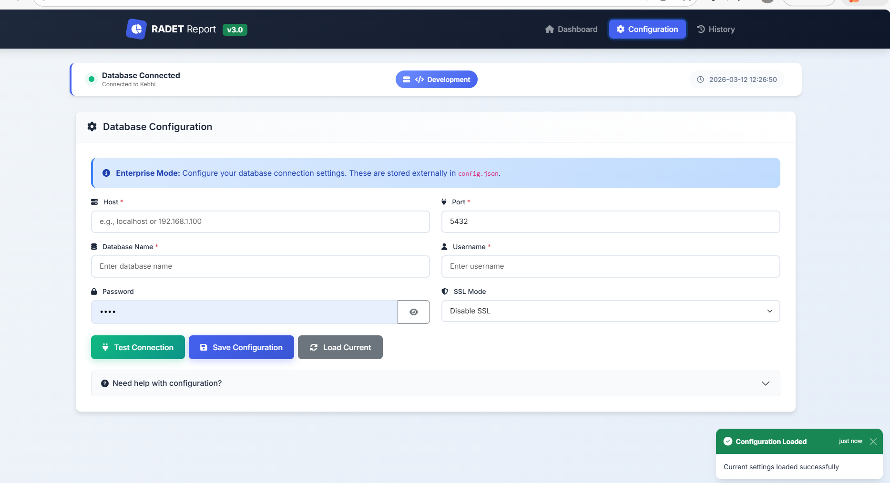

# RADET Report Generator v2.0

A modern, full-stack web application for generating RADET reports from PostgreSQL databases used in health data reporting and monitoring.

---

## 📸 Application Preview

### Dashboard



The dashboard provides an interface for generating RADET reports by selecting a date range and exporting the results.

Features include:

- Database connection status
- Date range selection
- Excel export generation
- System status monitoring

---

### Database Configuration



The configuration interface allows administrators to connect the application to a PostgreSQL database.

Configuration options include:

- Host address
- Database port
- Database name
- Username and password
- SSL mode
- Connection testing before saving

---

## ✨ Features

- 🎨 **Modern UI** – Clean and responsive user interface
- 🔒 **Secure Configuration** – No hardcoded credentials
- 📊 **Query Preview** – Display executed queries with parameters
- 📈 **Report History** – Track previously generated reports
- 🔌 **Connection Testing** – Validate database settings before saving
- 📁 **CSV / Excel Export** – Download reports with timestamped filenames
- ⚡ **Fast Processing** – Efficient backend query handling
- 🛡️ **Rate Limiting** – Protection against excessive requests

---

## 🏗️ System Architecture

The application is built using a full-stack architecture:

Frontend:
- HTML
- CSS
- JavaScript

Backend:
- Node.js
- Express.js

Database:
- PostgreSQL

---

## 🚀 Quick Start

### Prerequisites

- Node.js 14+
- PostgreSQL database
- npm or yarn

---

### Installation

1️⃣ Clone the repository

```bash
git clone https://github.com/Orlitech/radet-generator.git
cd radet-generator
